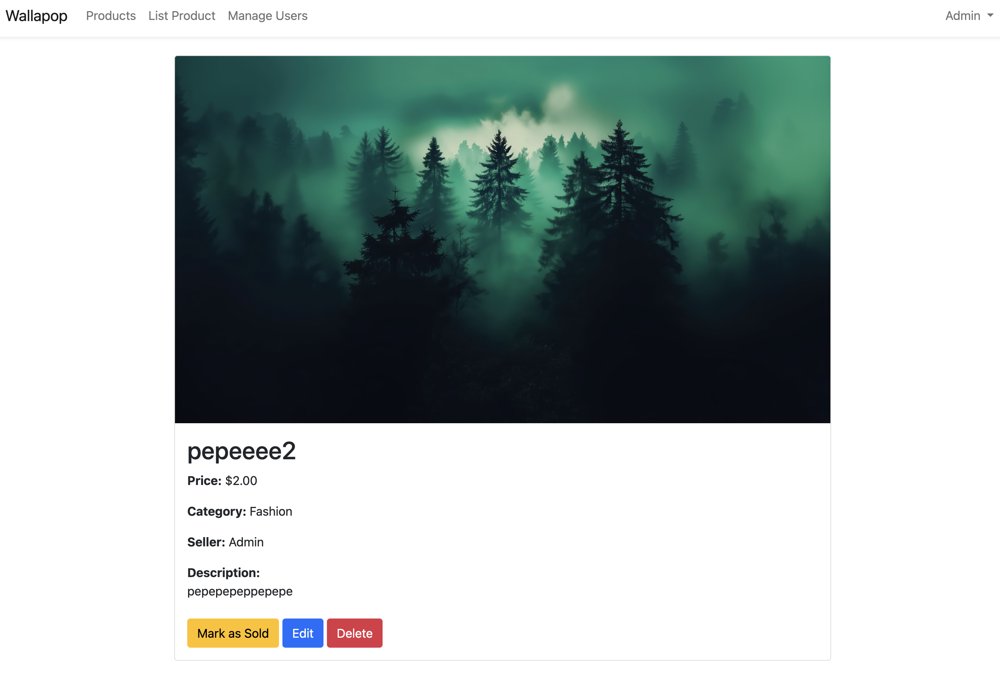
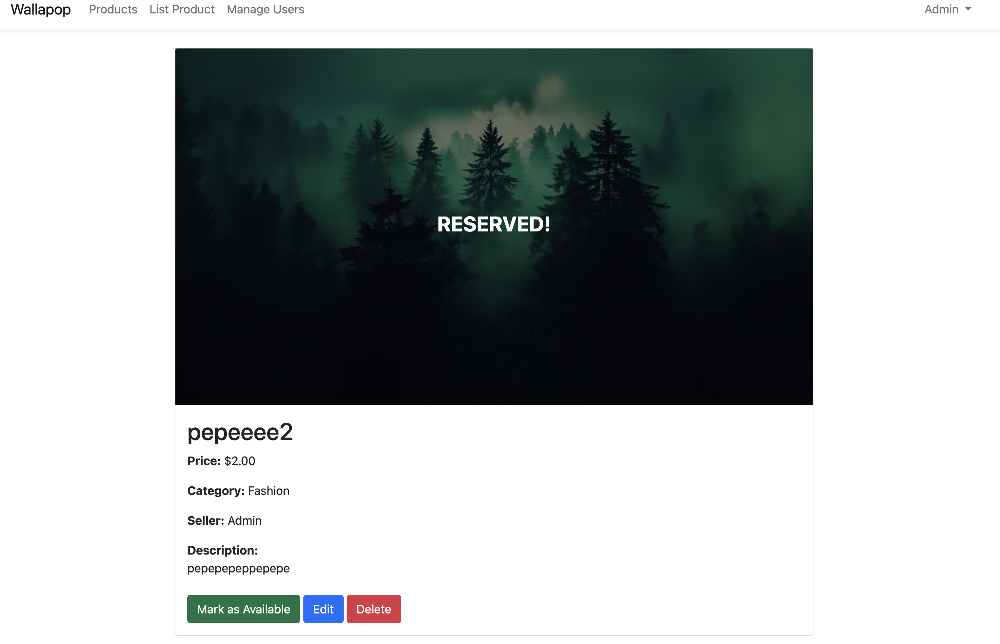
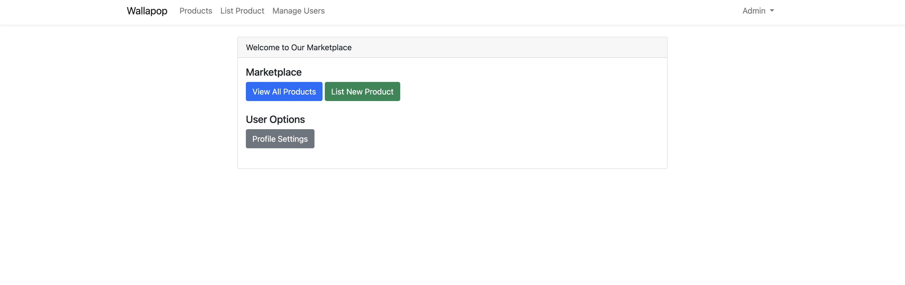
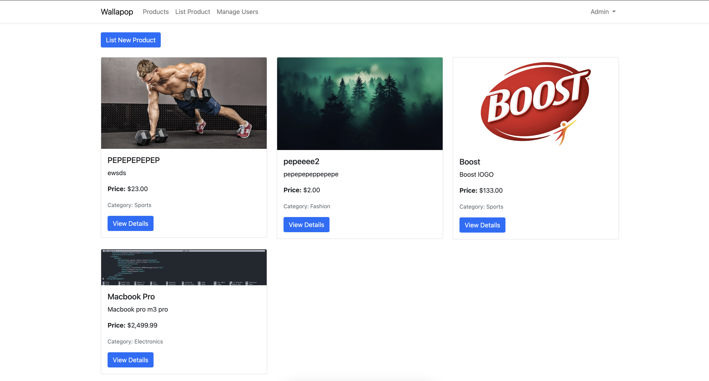
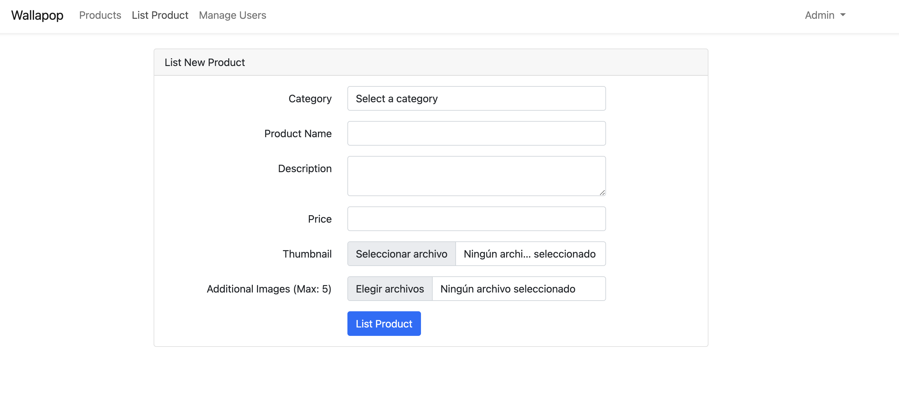
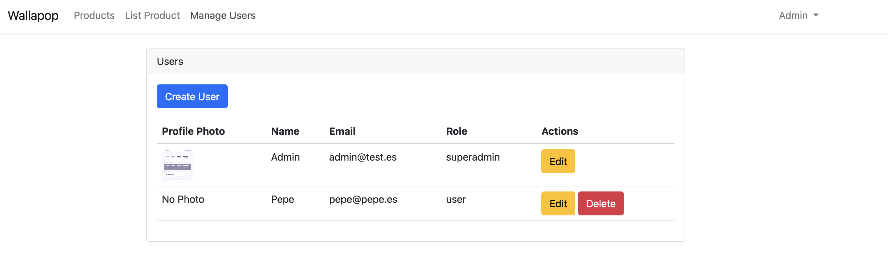
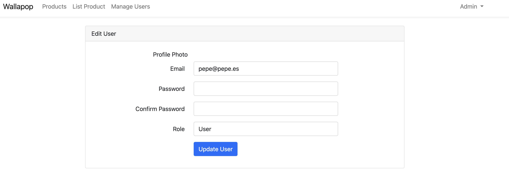

# Laravel Project

This is a project based on the Laravel framework. It includes functionalities for user management, authentication, and more.

## Requirements

- PHP >= 8.2
- Composer

## Installation

Follow these steps to install and set up the project:

1. Clone the repository:
    ```sh
    git clone https://github.com/davidrivasrodriguez/firstUserApp
    cd firstUserApp
    ```

2. Install PHP dependencies:
    ```sh
    composer install
    ```

3. Copy the environment file and configure the necessary variables:
    ```sh
    cp .env.example .env
    ```

4. Generate the application key:
    ```sh
    php artisan key:generate
    ```

5. Configure the database in the .env file and then run the migrations:
    ```sh
    php artisan migrate
    ```


## Usage

### User Management

The project includes routes for user management. You can access the following routes:

- Create user: `{admin,superadmin}/users/create`
- List users: `{admin,superadmin}/users`
- Edit user: `{admin,superadmin}/users/{user}/edit`
- Delete user: `{admin,superadmin}/users/{user}`

### Authentication

The project uses Laravel's basic authentication. You can register, log in, and manage authenticated users. And users can Upload profile image


## Screenshots

Here are some screenshots of the application:

### Login


### Register


### Home Page


### Profile Settings


### Create User


### User Management


### User Editing
