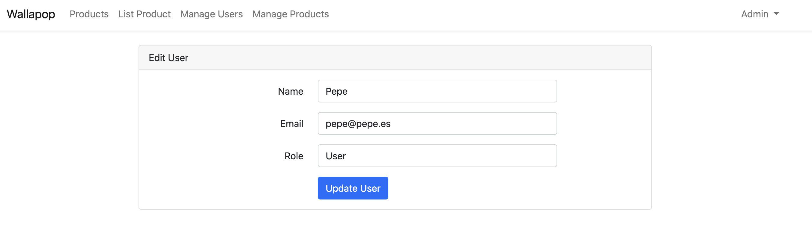

# Wallapop Marketplace

This is a marketplace project based on the Laravel framework. It includes functionalities for product listings, user management, authentication, and category management.

## Requirements

- PHP >= 8.2
- Composer
- MySQL/SQLite

## Installation

Follow these steps to install and set up the project:

1. Clone the repository:
    ```sh
    git clone https://github.com/davidrivasrodriguez/wallapop
    cd marketplace
    ```

2. Install PHP dependencies:
    ```sh
    composer install
    ```

3. Copy the environment file and configure the necessary variables:
    ```sh
    cp .env.example .env
    ```

4. Generate the application key:
    ```sh
    php artisan key:generate
    ```

5. Configure the database in the .env file and then run the migrations:
    ```sh
    php artisan migrate
    ```

## Usage

### Product Management

Users can perform the following actions:
- View all products: `/sales`
- Create new listing: `/sales/create`
- Edit listing: `/sales/{sale}/edit`
- Delete listing: `/sales/{sale}`

### Category Management (Admin Only)

Administrators can manage product categories through:
- View categories: `/categories`
- Create category: `/categories/create`
- Edit category: `/categories/{category}/edit`
- Delete category: `/categories/{category}`

### User Features

- User registration and authentication
- Profile management
- Product listing management
- Product image uploads
- Product browsing and search

### Admin Features

- User management
- Category management
- System settings
- Content moderation

## Screenshots

### Home Page


### Products For Sale


### Product Listing


### Product Details


### Reserved Product Details


### Product Edit


### User Management


### Admin User Editing


### Self User Editing
